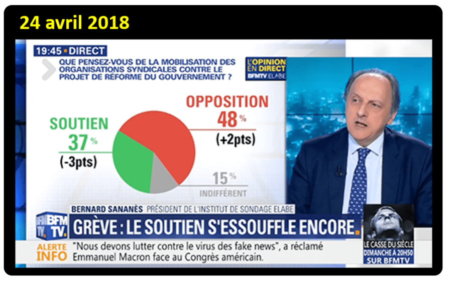
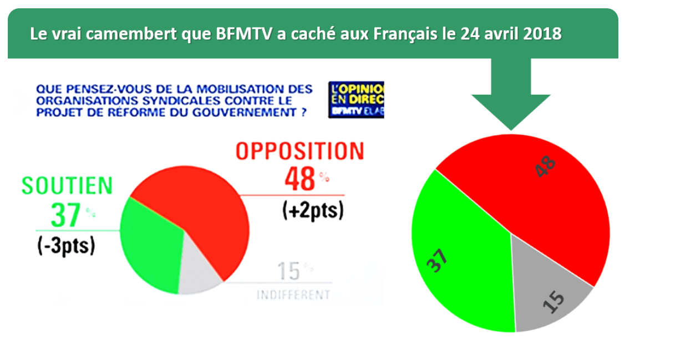
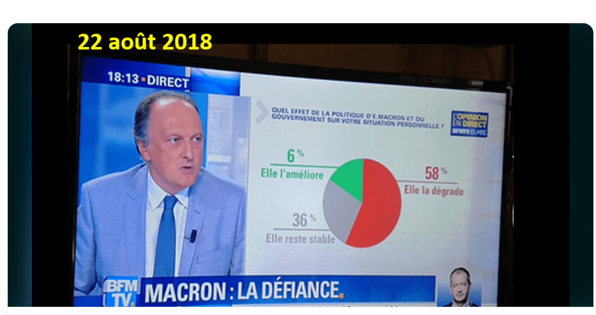
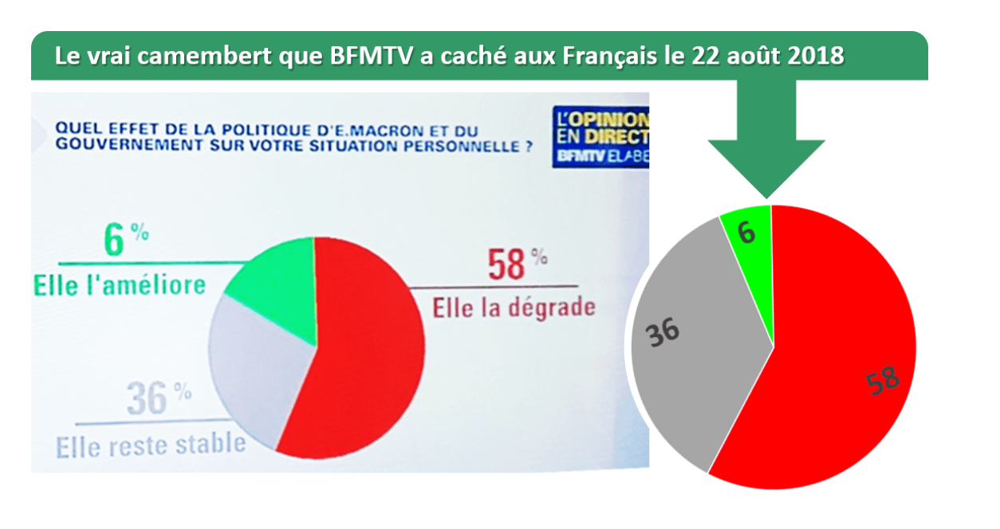
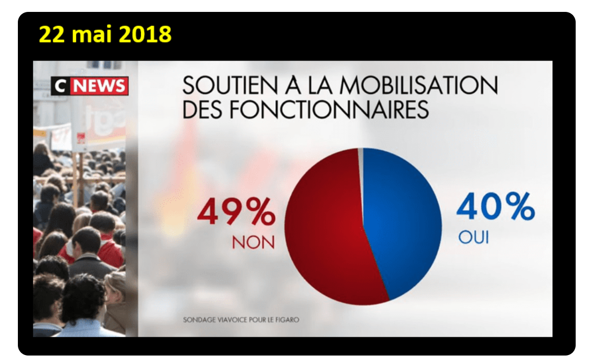

# 1. BFMTV – Sondage sur la mobilisation syndicale

### Contexte

Cette visualisation a été diffusée sur BFMTV le 24 avril 2018. Elle présente les résultats d’un sondage portant sur l’opinion des Français concernant la mobilisation des organisations syndicales contre le projet de réforme du gouvernement.

Les résultats indiqués sont :
- 48 % des personnes interrogées sont opposées à la mobilisation ;
- 37 % la soutiennent ;
- 15 % sont indifférentes.

### Pourquoi cette visualisation est trompeuse ?

Le problème vient de la représentation du graphique circulaire. Les pourcentages écrits à côté du graphique sont corrects, mais les proportions des secteurs ne correspondent pas exactement aux valeurs annoncées.

Le secteur de 48 % devrait représenter un peu moins de la moitié du cercle. Or, dans la visualisation, il apparaît comme une portion nettement plus grande.

De même, le secteur de 37 % est représenté comme beaucoup plus petit, et celui de 15 % ne correspond pas exactement à la proportion qu’il devrait occuper.

Ainsi, une personne qui regarde rapidement le graphique peut avoir une perception différente des résultats réels du sondage. C’est un exemple de visualisation trompeuse : les chiffres affichés sont corrects, mais leur représentation graphique donne une impression différente.

### Correction de la visualisation

Voici le corrigé de la visualisation afin de représenter les pourcentages avec des proportions réellement conformes aux résultats du sondage.

### Explication du corrigé

Le graphique corrigé représente les trois résultats avec leurs proportions réelles :

- 48 % pour les personnes opposées à la mobilisation ;
- 37 % pour les personnes favorables à la mobilisation ;
- 15 % pour les personnes indifférentes.

Dans un camembert, chaque secteur doit être proportionnel au pourcentage qu’il représente. Ainsi, 48 % doit occuper presque la moitié du cercle, 37 % doit être légèrement inférieur à 40 %, et 15 % doit représenter une petite partie du cercle.

Cette correction permet donc de comparer directement la visualisation originale avec une représentation fidèle des données. On constate que le graphique original donne une perception différente des proportions, alors que le graphique corrigé respecte les valeurs annoncées.

# 2. BFMTV – Sondage sur l’effet de la politique de Macron

### Contexte

Cette visualisation a été diffusée sur BFMTV le 22 août 2018. Elle présente les résultats d’un sondage portant sur l’effet de la politique d’Emmanuel Macron sur la situation personnelle des personnes interrogées.

Les résultats indiqués sont :

- 58 % estiment que la politique menée dégrade leur situation ;
- 36 % estiment qu’elle reste stable ;
- 6 % estiment qu’elle améliore leur situation.

### Pourquoi cette visualisation est trompeuse ?

Le problème vient de la représentation du camembert. Les pourcentages affichés sont de 58 %, 36 % et 6 %, mais les proportions des secteurs ne correspondent pas correctement à ces valeurs.

Le secteur de 58 % devrait représenter un peu plus de la moitié du cercle. Le secteur de 36 % devrait représenter un peu plus d’un tiers, tandis que le secteur de 6 % devrait être très petit.

Or, dans la visualisation présentée par BFMTV, le secteur correspondant à 6 % apparaît beaucoup plus grand qu’il ne devrait l’être.

Ainsi, une personne qui regarde principalement le graphique peut avoir une perception différente des résultats réels du sondage. Les chiffres sont affichés, mais leur représentation graphique est trompeuse.

### Correction de la visualisation

Le graphique ci-dessus présente le camembert corrigé à partir des pourcentages réellement annoncés dans le sondage diffusé sur BFMTV le 22 août 2018.

Les résultats du sondage étaient les suivants :

- **58 %** des personnes interrogées estimaient que la politique de Macron et du gouvernement **dégrade leur situation personnelle** ;
- **36 %** estimaient qu'elle **reste stable** ;
- **6 %** estimaient qu'elle **améliore leur situation personnelle**.

Ces trois valeurs représentent au total **100 %** des réponses. Le camembert doit donc respecter exactement ces proportions.

Dans la version corrigée, le secteur correspondant à **58 %** occupe un peu plus de la moitié du cercle. Le secteur de **36 %** représente un peu plus d'un tiers du cercle, tandis que celui de **6 %** est beaucoup plus petit, ce qui correspond réellement à sa valeur.

Cette correction permet de comparer directement les chiffres avec les tailles des secteurs. Dans la représentation diffusée initialement, les proportions visuelles des secteurs ne correspondaient pas correctement aux pourcentages affichés. Le secteur de 58 % était notamment représenté de manière différente de ce qu'il devrait être, tandis que les secteurs de 36 % et de 6 % étaient également disproportionnés.

La différence est importante car, dans un graphique, le lecteur regarde souvent d'abord les formes et les tailles avant de lire précisément les chiffres. Une personne qui regarde rapidement le camembert peut donc avoir une impression différente de celle donnée par les pourcentages réels.

Le camembert corrigé permet au contraire de comprendre immédiatement la répartition des réponses. On constate notamment que **58 % + 36 % = 94 %** des personnes interrogées considèrent que la politique du gouvernement dégrade leur situation ou reste sans amélioration. Seules **6 %** considèrent qu'elle améliore leur situation.

Cet exemple montre donc qu'une visualisation de données peut être trompeuse même lorsque les pourcentages écrits à côté du graphique sont corrects. Pour qu'une représentation soit fiable, les proportions graphiques doivent être cohérentes avec les données numériques.

# 3. CNEWS – 22 mai 2018

### Contexte

Cette visualisation a été diffusée sur CNEWS le 22 mai 2018. Elle présente un sondage sur le soutien à la mobilisation des fonctionnaires.

Les résultats indiqués sont les suivants :
- **49 %** des personnes interrogées répondent « non » ;
- **40 %** répondent « oui » ;
- **11 %** ne se prononcent pas.

### Pourquoi cette visualisation est trompeuse ?

Le problème vient de la représentation graphique des pourcentages. Le camembert ne respecte pas correctement les proportions annoncées à côté du graphique.

Le secteur correspondant à **49 %** devrait représenter presque la moitié du cercle. Le secteur correspondant à **40 %** devrait représenter une part légèrement inférieure. Enfin, les **11 %** sans opinion devraient occuper une petite partie du cercle.

Or, dans la visualisation présentée par CNEWS, les proportions des secteurs ne correspondent pas aux valeurs affichées. Le secteur associé aux 49 % apparaît beaucoup plus grand que celui des 40 %, et la partie correspondant aux 11 % est presque invisible.

Cette représentation peut donc donner au spectateur une impression différente des résultats réels du sondage. Une personne qui regarde principalement le graphique peut facilement sous-estimer la proportion des personnes favorables à la mobilisation.

Cet exemple montre qu'un graphique peut être trompeur même lorsque les pourcentages sont écrits clairement. Pour être fiable, un camembert doit respecter les proportions mathématiques des données qu'il représente.
