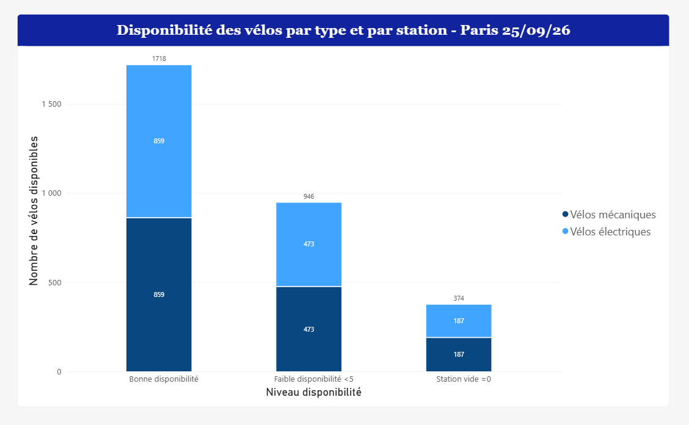

# Dans quelle mesure la répartition des vélos mécaniques et électriques révèle-t-elle des tensions et des risques de pénurie sur le réseau ?

### Analyse du graphique

Le graphique montre que le nombre de vélos disponibles diminue lorsque l'on passe d'une bonne disponibilité à une situation plus tendue. On passe de **1 718 vélos** en bonne disponibilité à **946 vélos** en faible disponibilité, puis à **374 vélos** dans les stations vides.

On remarque également que, dans les trois catégories, le nombre de vélos mécaniques et électriques est identique. Il y a donc une répartition de **50 % de vélos mécaniques et 50 % de vélos électriques** dans chaque catégorie.

### Réponse à la problématique

Le graphique montre donc que les tensions concernent les deux types de vélos de manière similaire. La diminution du nombre de vélos disponibles ne semble pas concerner uniquement les vélos mécaniques ou uniquement les vélos électriques. Cela peut plutôt montrer un problème général de disponibilité dans certaines stations.
